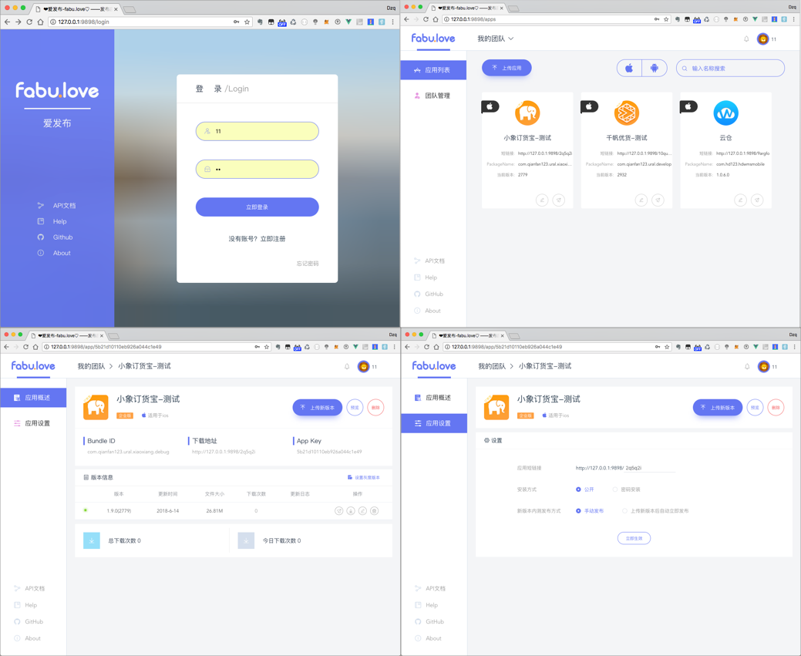

### 爱发布

demo地址: https://fabu.apppills.com/
该平台是类似于fir.im/蒲公英类似的一个平台.可以自己部署.


项目前后端分离开发:

前端使用 vue + element-ui

后端使用 nodejs + koa



### 项目结构

```
.
├── LICENSE
├── README.md
├── client //web端代码 vue + element UI
├── docker  //使用docker部署的配置文件
├── fabu_nginx.conf  //server端nginx配置文件
├── screenshots  //屏幕截图
├── server  //服务端代码node+koa
└── wiki //todo 还在编写中
```

### 运行步骤

#### 使用docker运行（建议）

> ps：请先安装docker
1. 下载源码  `git clone https://github.com/HeadingMobile/fabu.love.git`
2. 执行`cd docker`
3. 执行`docker-compose up -d --build`
4. 打开浏览器 http://0.0.0.0:9898


#### 本地运行

运行前准备

* 安装 MongoDB (3.6)
* 安装 Nodejs
* 安装 pm2、babel-node

```bash
npm install -g pm2 babel-cli
```

* 安装 cnpm

```bash
npm install -g cnpm --registry=https://registry.npm.taobao.org
```

1.clone 下载代码 `git clone https://github.com/HeadingMobile/LoveFabu.git`

2.运行server端

```bash
#进入项目根目录
cd server
cnpm install  #安装依赖
npm start

=============>>out
...
...
App is listening on 9898.
数据库连接成功
=============>>end
```

3.编译运行前端页面

```Bash
cd client
cnpm install
npm run build #正式环境可以用该命令编译静态文件交给nginx
npm run dev  #本地运行可以使用该命令

============>>out
...
...
 DONE  Compiled successfully in 18546ms                                                
 I  Your application is running here: http://0.0.0.0:9898
============>>end
```

4.使用浏览器打开进入http://localhost:9898即可进入应用


### 项目配置说明

**前端配置**

无需配置

**后端配置**

参见 server/config.js

```javascript
//需要修改配置可以修改config.js文件,也可以在部署的时候导出环境变量
//比如 export FABU_BASE_URL=https://127.0.0.1:9898

const common = {
    //baseUrl应用请求的url地址,比如https://fabu.love
    baseUrl: process.env.FABU_BASE_URL || "https://127.0.0.1:9898", 
    port: process.env.FABU_PORT || "9898", //server运行的端口
    apiPrefix: 'api',
    fileDir: process.env.FABU_UPLOAD_DIR || path.join(__dirname, ".."), //上传文件的存放目录
    secret: process.env.FABU_SECRET || "secretsecret", //secret
    //数据库用户 (没有开启mongodb用户认证的可以不填写)
    dbUser: process.env.FABU_DBUSER || undefined,  
    //数据库密码 (没有开启mongodb用户认证的可以不填写)
    dbPass: process.env.FABU_DBPWD || undefined,  
    dbName: process.env.FABU_DB_NAME || "fabulove", //数据库名称
    dbHost: process.env.FABU_DB_HOST || "localhost", //数据库地址
    dbPort: process.env.FABU_DB_PORT || "27017", //数据库端口
	
    //邮件相关配置 用于找回密码和邀请团队成员发送邮件
    emailService: process.env.FABU_EMAIL_SERVICE || "qq", 
    emailUser: process.env.FABU_EMAIL_USER || "", 
    emailPass: process.env.FABU_EMAIL_PASS || "",

    //是否允许用户注册,为否则后端注册接口不可用
    allowRegister: process.env.FABU_ALLOW_REGISTER || true, 

    //是否开启ldap 默认是false 如果公司没有ldap服务可以不用理会
    openLdap: process.env.FABU_ALLOW_LDAP || false, 
    ldapServer: process.env.FABU_LDAP_URL || "",  //ldap server url
    ldapUserDn: process.env.FABU_LDAP_USERDN || "", //ldap管理员dn 管理员用户名
    ldapBindCredentials: process.env.FABU_LDAP_CREDENTIALS || "", //ldap管理员密码
    ldapBase: process.env.FABU_LDAP_BASE || "" //ldap base

};
```


### 正式环境部署 nginx配置(注意请使用https部署,否则iOS会出现无法安装的问题)

可以按照项目根目录的 fabu_nginx.conf 文件进行配置

```bash
server{
  listen 80;
  server_name fabu.love;

  #root目录为项目根目录的client/dist目录下,前端静态页面
  root /home/ubuntu/fabulove/client/dist;
  index index.html;

  location / {
      try_files $uri $uri/ @router;
      index index.html;
  }

  location /upload/ {
      #该root目录为根目录下config.json文件里dir目录 上传的apk和ipa文件当作静态文件处理
      root /home/ubuntu/fabulove/upload;
      expires  30d;
  }

  location @router {  # vue的router配置
      rewrite ^.*$ /index.html last;
  }

  location /api/ {  #把以api打头的接口转发给后端server
    proxy_pass http://127.0.0.1:9898; #这里端口修改为后端服务运行的端口
    proxy_set_header Host $host;
    proxy_set_header X-Forwarded-For $proxy_add_x_forwarded_for;
  }
  client_max_body_size 208M; #最大上传的ipa/apk文件大小
}
```

