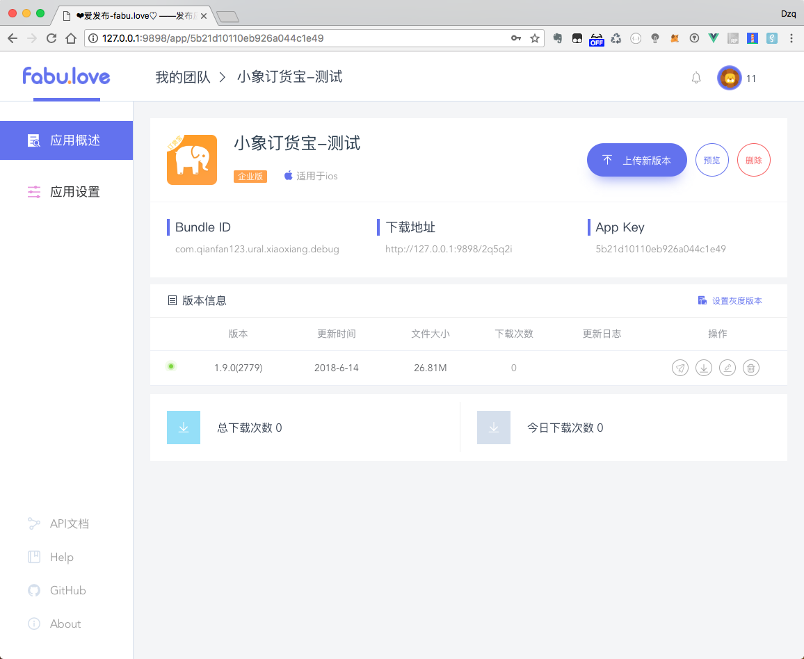

####爱发布

demo地址: https://fabu.love
该平台是类似于fir.im/蒲公英类似的一个平台.可以自己部署.


项目前后端分离开发:

前端使用 vue + element-ui

后端使用 nodejs + koa

截图 | 截图  
- | :-: |
  | |  
  |  | 


#### 安装前准备

* 安装 MongoDB
* 安装 Nodejs
* 安装 pm2、babel-node

```bash
npm install -g pm2 babel-cli
```

* 安装 cnpm

```bash
npm install -g cnpm --registry=https://registry.npm.taobao.org
```

#### 安装步骤

1.clone 下载代码 `git clone https://github.com/HeadingMobile/LoveFabu.git`

2.安装依赖

```bash
#进入项目根目录

cnpm install  #安装依赖
```

3.修改运行配置

//修改根目录config.json的配置文件

```bash
{
    "url":"http://127.0.0.1:9898", #前端请求的地址,本地运行需要带上端口号,
    "port":"9898", #后端程序运行的端口
    "secret":"XXXX-XXXX", #加密字符串
    "dir":"/Volumes/UserData/ProjectSource/NodeProject/upload", #静态文件上传目录
    "dbuser":"xxx",#数据库用户名 如果mongodb有设置认证信息需要配置dbuser和dbpass
    "dbpass":"xxx",#数据库密码
}
```

//也可以使用`node app config --url xxx --port xxx --dbuser xxx --dbpass xxx`进行配置

4.安装项目client和server的依赖

```python
node app init #相当于cd client/ && cnpm install 和 cd server/ && cnpm install
```

```python
node app build #编译前端工程,相当于cd client/ && npm run build
```

```python
node app start 
#运行项目, 相当于 cd server && pm2 start process.json
#如果不用pm2运行,在本地运行可以使用cd server &&  npm start
#使用 node app start -i -b , 相当于使用node app init && node app build && node app start
#修改根目录config文件之后,必须执行node app build,重新编译前端文件
```


#### 正式环境部署配置 nginx

可以按照项目根目录的 fabu_nginx.conf 文件进行配置

```bash
server{
  listen 80;
  server_name fabu.love;

  #root目录为项目根目录的client/dist目录下
  root /home/ubuntu/fabulove/client/dist;
  index index.html;

  location / {
      try_files $uri $uri/ @router;
      index index.html;
  }

  location /upload/ {
      #该root目录为根目录下config.json文件里dir目录
      root /home/ubuntu/fabulove/upload
      expires  30d;
  }

  location @router {
      rewrite ^.*$ /index.html last;
  }

  location /api/ {
    proxy_pass http://127.0.0.1:8383; #这里端口修改为 config.json文件中的port内容
    proxy_set_header Host $host;
    proxy_set_header X-Forwarded-For $proxy_add_x_forwarded_for;
  }
  client_max_body_size 208M; #最大上传的ipa/apk文件大小
}
```

